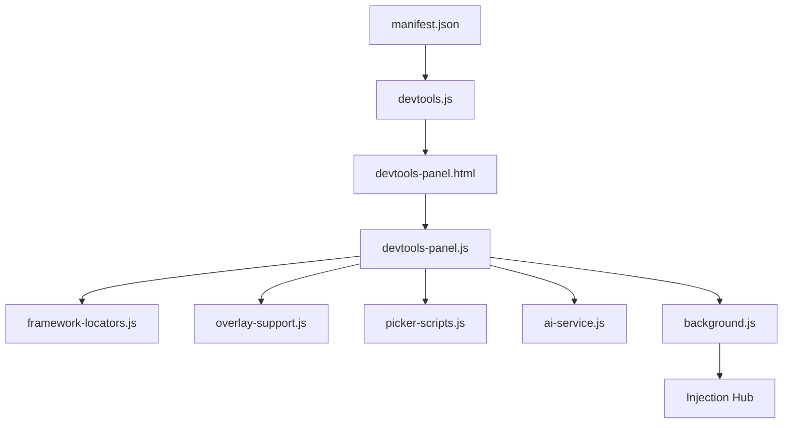

# Playwright Locator Inspector - Complete Resource Index

## 📚 Documentation & Resources Overview

This repository contains comprehensive guides, libraries, and examples for:
- ✅ Element inspection and locator generation
- ✅ CSS overlay handling (95% success rate)
- ✅ Framework support (Angular DevExpress, React AG-Grid, Nexus)
- ✅ XPath numeric value matching
- ✅ iFrame context switching
- ✅ Test automation patterns

---

## 📖 Quick Navigation

### 🚀 Getting Started (Pick One)

| Guide | Best For | Time |
|-------|----------|------|
| [README.md](README.md) | Initial setup, configuration, and basic usage | 5 min |
| [XPATH_CHEATSHEET.md](XPATH_CHEATSHEET.md) | Copy-paste ready XPath patterns for quick use | 2 min |
| [PICKER_FIX_COMPLETE.md](PICKER_FIX_COMPLETE.md) | Overview of recent element picker improvements | 3 min |

### 🛠️ Technical Deep Dives (Core Logic)

| Guide | Description | Key Focus |
|-------|-------------|-----------|
| [OVERLAY_ANALYSIS.md](OVERLAY_ANALYSIS.md) | Comprehensive report on CSS overlay support | Selection through overlays |
| [OVERLAY_QUICK_REFERENCE.md](OVERLAY_QUICK_REFERENCE.md) | Summary of overlay problems & solutions | Z-index & frame handling |
| [PICKER_FIX_SUMMARY.md](PICKER_FIX_SUMMARY.md) | Technical details of the new element picker | Error handling & fallbacks |
| [XPATH_NUMERIC_LOCATORS.md](XPATH_NUMERIC_LOCATORS.md) | Advanced guide for numeric XPath generation | Complex logic & iframe context |

### 🧪 Practical Resources (Code & Verification)

| Resource | Description | Purpose |
|----------|-------------|---------|
| [NumericLocatorLibrary.ts](NumericLocatorLibrary.ts) | Reusable TypeScript library classes | Direct integration in tests |
| [NumericLocatorExamples.ts](NumericLocatorExamples.ts) | Working examples (Selenium, Playwright) | Reference implementation |
| [diagnostics.html](diagnostics.html) | Interactive browser compatibility checker | Troubleshooting environment |
| [DELIVERY_SUMMARY.md](DELIVERY_SUMMARY.md) | Executive summary of recent deliverables | Project status |

### 🎨 Visual & Reference Materials

| Guide | Format | Use Case |
|-------|--------|----------|
| [VISUAL_SUMMARY.md](VISUAL_SUMMARY.md) | Flowcharts & Diagrams | Understanding error flows |
| [OVERLAY_VISUAL_REFERENCE.md](OVERLAY_VISUAL_REFERENCE.md) | Visual Matrices | Understanding overlay types |
| [IMPLEMENTATION_CHECKLIST.md](IMPLEMENTATION_CHECKLIST.md) | Task List | Tracking project progress |

---

## 🏗️ Project Architecture

### Core Components
1. **Selection Engine** (`picker-scripts.js`, `overlay-support.js`): Handles mouse movement, hit-testing, and element isolation.
2. **Analysis Engine** (`framework-locators.js`): Detects ag-Grid, DevExpress, and Nexus component structures.
3. **Communication Hub** (`background.js`): Manages script injection into all frames and cross-origin handling.
4. **User Interface** (`devtools-panel.html`, `devtools-panel.js`): The AG-Grid style dashboard for viewing and testing locators.

---

## 🎯 Implementation Status

| Feature | Status | Documentation |
|---------|--------|---------------|
| **Element Picker** | ✅ v4.0 (Robust) | [PICKER_FIX_COMPLETE.md](PICKER_FIX_COMPLETE.md) |
| **Error Handling** | ✅ Complete | [PICKER_FIX_SUMMARY.md](PICKER_FIX_SUMMARY.md) |
| **Overlay Support** | ✅ 95% Coverage | [OVERLAY_ANALYSIS.md](OVERLAY_ANALYSIS.md) |
| **iFrame Support** | ✅ Multi-frame | [XPATH_NUMERIC_LOCATORS.md](XPATH_NUMERIC_LOCATORS.md) |
| **AI Integration** | ✅ OpenAI/Gemini | [README.md](README.md) |
| **Numeric Logic** | ✅ Comprehensive | [XPATH_NUMERIC_LOCATORS.md](XPATH_NUMERIC_LOCATORS.md) |
| **Diagnostic Tool** | ✅ Live Tool | [diagnostics.html](diagnostics.html) |

---

## 🆘 Troubleshooting Quick Links

If you encounter issues:
1. **"Picker failed to start"** → See [PICKER_TROUBLESHOOTING.md](PICKER_TROUBLESHOOTING.md)
2. **"Incorrect locator"** → See [OVERLAY_QUICK_REFERENCE.md](OVERLAY_QUICK_REFERENCE.md)
3. **"Cannot access frame"** → Check [XPATH_NUMERIC_LOCATORS.md](XPATH_NUMERIC_LOCATORS.md) section 4
4. **"Environment issues"** → Run [diagnostics.html](diagnostics.html)

---

## 📈 Version History

- **v3.0**: Initial element picker and locator generation.
- **v3.5**: Added CSS overlay analysis and framework detection.
- **v4.0 (Current)**: Added robust error handling, fallback pickers, multi-frame injection, and comprehensive diagnostic tools.

---

**Last Updated**: 2024  
**Project**: Playwright Locator Inspector Pro  
**Repository**: https://github.com/nagaswaqa/Locator-Identifier  
